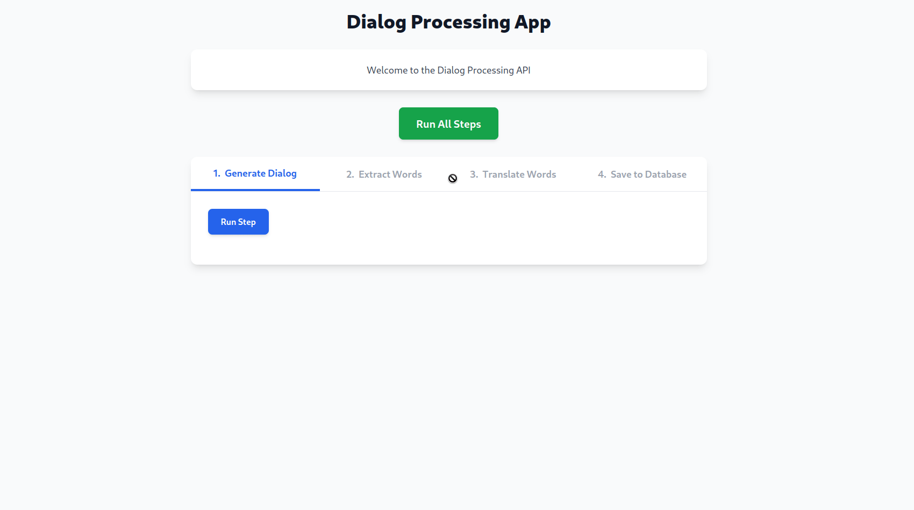

# Golang Test Project


## Task 1: Groq API Integration with Iris Framework (`01`)

[Link Demo](https://groq-api.hoangvangioi.com)

### Overview
This task implements a Golang web application using the Iris framework to interact with the Groq API. The app features a simple web interface with a text area for users to input prompts. Upon submission, it queries the Groq API, retrieves a Markdown-formatted response, converts it to HTML, and displays it in a well-formatted layout.

### Prerequisites
- **Golang**: Version 1.24 or higher
- **Groq API Key**: Obtainable from [GroqCloud](https://groq.com)
- **Dependencies**:
  - `github.com/kataras/iris/v12`
  - `github.com/joho/godotenv`
  - `github.com/yuin/goldmark`

### Setup and Execution
1. Navigate to the task directory:
   ```bash
   cd 01
   ```
2. Install dependencies:
   ```bash
   go get github.com/kataras/iris/v12
   go get github.com/joho/godotenv
   go get github.com/yuin/goldmark
   go mod tidy
   ```
3. Create a `.env` file in the directory with:
   ```
   GROQ_API_KEY=<your-groq-api-key>
   GROQ_API_URL=<your-groq-api-url>
   ```
4. Start the application:
   ```bash
   go run main.go
   ```

### Implementation Steps

1. **Define structures**: Create `Config` for API key/URL, `Request` for prompt input, and `Response` for output/error.  
2. **Load config**: Read `GROQ_API_KEY` and `GROQ_API_URL` from `.env` using `godotenv`, set default URL if needed.  
3. **Build client**: Implement `groqClient` with `newGroqClient()` to handle API calls.  
4. **Call Groq API**: In `callGroqAPI()`, send prompt to Groq API, parse response, convert Markdown to HTML with `goldmark`.  
5. **Set up Iris**: Initialize Iris, serve `./views` static files, define GET `/` for webpage and POST `/api/groq` for API.  
6. **Handle requests**: GET serves `index.html`; POST validates prompt, calls API, returns HTML or error as JSON.  

### Screenshot


---

## Task 2: SSML Generator with HTML and JavaScript (`02`)

[Link Demo](https://generate-ssml.hoangvangioi.com)

### Overview
This task builds a lightweight HTML/JavaScript application to generate a Speech Synthesis Markup Language (SSML) file from a predefined dialogue between two speakers. Users can select voices for each speaker from dropdown menus, and the app generates the corresponding SSML output.

### Prerequisites
- **Web Browser**: Any modern browser (e.g., Chrome, Firefox)
- **Optional**: Node.js and `live-server` for local hosting (`npm install -g live-server`)

### Setup and Execution
1. Navigate to the task directory:
   ```bash
   cd 02
   ```
2. Open `index.html` in a browser:
   - **Directly**: Double-click the file or drag it into a browser.
   - **With Local Server** (recommended):
     ```bash
     live-server
     ```
     Then visit `http://localhost:8080`.

### Implementation Steps

1. **Get inputs**: Retrieve `voiceA`, `voiceB`, and `conversation` values from DOM elements using `getElementById`.  
2. **Parse conversation**: Split `conversation` into lines, filter out empty ones.  
3. **Generate SSML**: Build SSML string with `<speak>` root; add `<voice>` tags for lines starting with "A:" or "B:", using respective voice values.  
4. **Highlight syntax**: Escape special characters (`&`, `<`, `>`); use regex to wrap tags, attributes, values, and brackets in `<span>` for styling.  
5. **Display output**: Set `highlighted` SSML to `ssmlOutput.innerHTML` and store raw SSML in `dataset.ssml`.  
6. **Copy functionality**: On `copyBtn` click, copy raw SSML from `dataset.ssml` to clipboard, update button text to "✅ Đã copy!" for 2 seconds, then revert to "Copy".  

### Screenshot


---

## Task 3: Automated Dialogue Processing with Iris and PostgreSQL - MVC(`03`)

[Link Demo](https://dialogue.hoangvangioi.com)

### Overview
This task develops a Golang web application using the Iris framework to automate dialogue generation, keyword extraction, translation, and storage in PostgreSQL. It integrates the Groq API (model: `deepseek-r1-distill-llama-70b`) to generate a Vietnamese dialogue, extract key words, translate them to English, and persist the results in a database. The web interface displays each step’s output.

### Prerequisites
- **Golang**: Version 1.24 or higher
- **PostgreSQL**: Version 16 or higher
- **Groq API Key**: Obtainable from [GroqCloud](https://groq.com)
- **Dependencies**:
  - `github.com/kataras/iris/v12`
  - `github.com/lib/pq`
  - `github.com/joho/godotenv`

### Setup and Execution
1. Navigate to the task directory:
   ```bash
   cd 03
   ```
2. Initialize the module and install dependencies:
   ```bash
   go get github.com/kataras/iris/v12
   go get github.com/lib/pq
   go get github.com/joho/godotenv
   go mod tidy
   ```
4. Create a `.env` file in the directory with:
   ```
   DATABASE_URL=<your-database-url>
   GROQ_API_KEY=<your-groq-api-key>
   GROQ_API_URL=<your-groq-api-url>
   ```
5. Launch the application:
   ```bash
   go run main.go
   ```

### Implementation Steps

1. **Define data structures**: Create `GroqRequest`, `Message`, and `GroqResponse` structs for API interactions; use `models` for database entities.  
2. **Load config**: In `main.go`, load environment config (`LoadConfig`) and connect to PostgreSQL (`ConnectDB`).  
3. **Set up Iris**: Initialize Iris app, register HTML view engine (`./views`), and define routes (`/` for index, `/process` for processing).  
4. **Serve homepage**: Implement `IndexHandler` to render `index.html`.  
5. **Process dialog**: In `ProcessHandler`:  
   - Generate Vietnamese dialog via `callGroqAPI` with a prompt, extract content with `extractDialog`.  
   - Save dialog to `dialog` table, retrieve ID.  
   - Extract key words (JSON) using Groq API, skipping proper nouns.  
   - Translate words to English (JSON) with Groq API.  
   - Store words in `word` table and link to dialog in `word_dialog` table.  
   - Pass data to `index.html` for display.  
6. **Call Groq API**: Implement `callGroqAPI` to send POST requests, handle JSON responses, and return content or errors.  
7. **Database operations**:  
   - `saveDialogToDB`: Insert dialog, return ID.  
   - `saveWordToDB`: Insert or retrieve word ID, add translation.  
   - `createWordDialogRelation`: Link dialog and words, avoid duplicates.  

### Screenshot


## Task 3 (v2): Automated Dialogue Processing with Iris and PostgreSQL - REST API(`03_v2`)

[Link Demo](https://dialogue-v2.hoangvangioi.com)

### Overview
This task develops a Golang web application using the Iris framework to automate dialogue generation, keyword extraction, translation, and storage in PostgreSQL. It integrates the Groq API (model: `deepseek-r1-distill-llama-70b`) to generate a Vietnamese dialogue, extract key words, translate them to English, and persist the results in a database. The web interface displays each step’s output.

### Prerequisites
- **Golang**: Version 1.24 or higher
- **PostgreSQL**: Version 16 or higher
- **Groq API Key**: Obtainable from [Groq](https://groq.com).
- **Node.js**: Optional, for serving the frontend statically.
- **Dependencies**:
  - `github.com/kataras/iris/v12`
  - `github.com/lib/pq`
  - `github.com/joho/godotenv`
  - `github.com/iris-contrib/middleware/cors`

### Setup and Execution
1. Navigate to the task directory:
   ```bash
   cd 03_v2
   ```
2. Initialize the module and install dependencies:
   ```bash
   go get github.com/kataras/iris/v12
   go get github.com/lib/pq
   go get github.com/joho/godotenv
   go get github.com/iris-contrib/middleware/cors
   go mod tidy
   ```
3. Create a `.env` file in the directory with:
   ```
   DATABASE_URL=<your-database-url>
   GROQ_API_KEY=<your-groq-api-key>
   GROQ_API_URL=<your-groq-api-url>
   ```
4. Launch the application:
   ```bash
   go run main.go
   ```
5. Serve the Frontend:
   Serve `index.html` (from the project directory or a separate folder):
   - **Node.js** (requires `serve`):
     ```bash
     npm install
     npm start
     ```
   Open a browser and navigate to `http://localhost:3000/index.html`.

### Implementation Steps

1. **Define Structures**: Create `GroqRequest`, `Message`, `GroqResponse` for API calls, and `APIResponse` for standardized JSON responses.  
2. **Set Up Iris**: In `main.go`, initialize Iris, enable CORS, load config (`LoadConfig`), connect to PostgreSQL (`ConnectDB`), and define REST routes.  
3. **Handle Index**: Implement `IndexHandler` to return a welcome JSON message.  
4. **Generate Dialog**: In `GenerateDialogHandler`:  
   - Call Groq API with a fixed prompt to generate a 6-sentence Vietnamese dialog.  
   - Extract dialog content with `extractDialog`, save to `dialog` table, return dialog and ID as JSON.  
5. **Extract Words**: In `ExtractWordsHandler`:  
   - Accept dialog via URL param, use Groq API to extract key words (JSON), return as `extractedWords`.  
6. **Translate Words**: In `TranslateWordsHandler`:  
   - Accept words via JSON body, translate to English with Groq API (JSON), return as `translatedWords`.  
7. **Save Words**: In `SaveWordsHandler`:  
   - Accept `dialogID` and `translatedWords` via JSON, save to `word` table, link to dialog in `word_dialog`, return saved data.  
8. **API Helper**: Implement `callGroqAPI` to send POST requests to Groq, parse responses, and handle errors.  

### Screenshot


